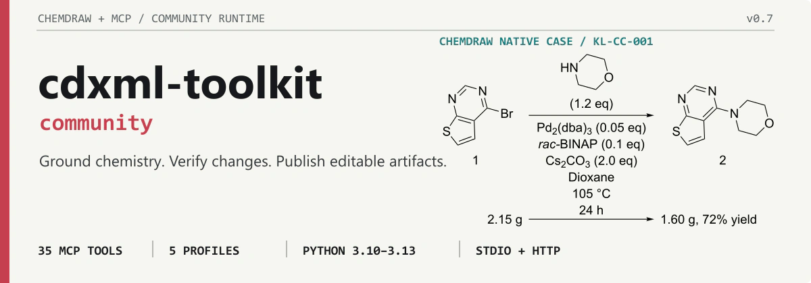
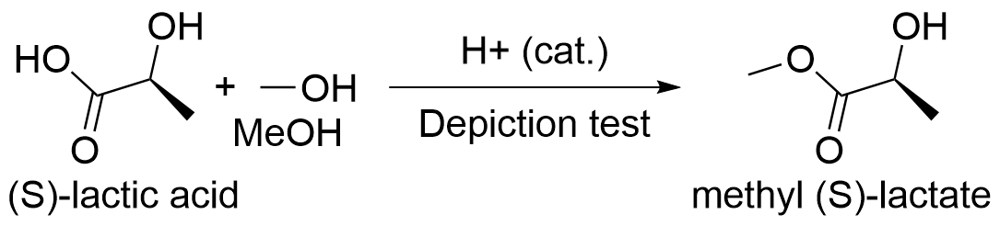

> **Platform support:** Portable CDXML and RDKit workflows run on Windows, macOS,
> and Linux. ChemDraw COM rendering, ChemScript, and editable ChemDraw objects in
> Word or PowerPoint require a Windows host with a licensed desktop ChemDraw
> installation.

<p align="center">
  <a href="https://github.com/ZiChenWang114514/cdxml-toolkit-community/actions/workflows/validate.yml"></a>
  <a href="https://github.com/ZiChenWang114514/cdxml-toolkit-community/releases/tag/v0.7.0a1"></a>
  <a href="https://www.python.org/"></a>
  <a href="./docs/mcp-tools.md"></a>
  <a href="./LICENSE"></a>
</p>

<p align="center">
  <strong>A community-maintained MCP and Python runtime for reliable chemistry artifact work.</strong><br>
  Resolve structures, compare molecules, build reaction schemes, inspect experiments, and deliver editable CDXML or ChemDraw objects in Office.
</p>

<p align="center">
  <a href="#publication-figures">Publication figures</a> ·
  <a href="#quick-start">Quick start</a> ·
  <a href="#connect-an-agent">Connect an agent</a> ·
  <a href="#tool-profiles">Tool profiles</a> ·
  <a href="./docs/mcp-tools.md">Tool reference</a> ·
  <a href="./docs/maintenance.md">Maintenance</a>
</p>

## A real editable scheme

The repository produces native chemistry artifacts, not screenshot-only output. The reaction below was exported directly from the editable CDXML through ChemDraw COM; its YAML description and PNG render are retained beside the source:


[YAML source](./samples/consolidated/two-step-scheme.yaml) ·
[Editable CDXML](./samples/consolidated/two-step-scheme.cdxml) ·
[Native PNG](./samples/consolidated/two-step-scheme.png) ·
[More scheme examples](./experiments/scheme_dsl/showcase/INDEX.md)

## Publication figures

Create editable figures with explicit atom coordinates, six reaction-arrow styles, electron arrows, rich conditions, atom numbering and native-template preservation. This native ChemDraw output exercises multi-reactant layout and stereochemical depiction:



[Editable CDXML](./samples/publication-figures/stereo-reaction.cdxml) · [Agent Skill: drawing and review guide](https://github.com/ZiChenWang114514/chemdraw-skill/blob/main/skill/chemdraw/references/image-visual-review.md)

| New tool | Use it for |
| --- | --- |
| `compose_chemical_figure` | Fixed-coordinate structures, arrows, rich text, grids, highlights and native templates |
| `rdkit_workbench` | Inspect atom indices and CIP labels; explicit stereo edits, bounded stereoisomer/tautomer enumeration, MCS and R-group decomposition |
| `compare_figure_images` | Save side-by-side images and difference measurements for actual visual review |

The renderer checks chemical identity by reading back final CDXML coordinates. Wavy bonds remain unspecified; enhanced AND/OR/ABS stereo groups are retained. Chemistry checks and visual similarity are separate: neither a valid SMILES nor a low image-difference score proves a faithful paper reproduction. Unsupported fresh radical and non-tetrahedral depictions require a verified native template.

**Version scope:** these features are on `main` after the `v0.7.0a1` release tag. Use the source installation below; the existing release tag has not been moved.

### From a paper screenshot to editable ChemDraw

**A worked reproduction of the supplied synthesis-scheme excerpt.** The agent segmented the figure, used DECIMER API recognition, redrew in ChemDraw, inspected side-by-side comparisons, corrected structures, and assembled visually transcribed conditions.

**Original paper excerpt — supplied by the user**


**Editable reconstruction — ChemDraw-native output**


[Download editable CDXML](assets/readme/paper-replica/replica.cdxml) · [Inspect structure-by-structure comparisons](assets/readme/paper-replica/structure-comparison.png) · [Case provenance](assets/readme/paper-replica/provenance.json)

Review corrected OH/CH₃ and OMe/OH recognition errors, restored X/R abbreviations, and removed an unsupported configuration at a wavy bond. All five corrected structures passed final-CDXML readback in this case; 17a/17b retain the source's shared wavy-bond representation.

**Visually reviewed and editable; not pixel-identical.** Font metrics, arrows and some line geometry still differ. Chemical readback agreement does not establish absolute recognition accuracy.

## What it provides

| Area | Practical result |
| --- | --- |
| Chemistry grounding | Resolve names, abbreviations, CAS numbers, formulas, and recognized image candidates through databases, ChemScript, OPSIN, or DECIMER. |
| Controlled structure work | Compare molecules, apply named transformations, preserve stereochemistry, and inspect MCS-based structural differences. |
| ChemDraw output | Draw molecules, clean or merge schemes, convert CDX/CDXML, and render native PNG or SVG files. |
| Office workflows | Extract, replace, and batch-embed editable ChemDraw OLE objects in PowerPoint and Word. |
| Experiment workflows | Parse ELN exports, SciFinder RDF, LCMS or NMR reports, and assemble structured lab-book material. |
| Agent service | Run through stdio locally or authenticated Streamable HTTP for a trusted remote computer. |

## Quick start

**Required:** 64-bit Python 3.10–3.13. Portable CDXML and RDKit operations run without ChemDraw. Native rendering, ChemScript, and editable Office objects require Windows plus a licensed desktop ChemDraw installation. Python 3.14 is not supported yet.

```powershell
conda create -n cdxml python=3.12 pip -y
conda activate cdxml

git clone https://github.com/ZiChenWang114514/cdxml-toolkit-community.git
Set-Location .\cdxml-toolkit-community

# Both distributions expose the cdxml_toolkit import package.
pip uninstall -y cdxml-toolkit
pip install -e ".[all]"

# Read-only environment and capability report.
cdxml-doctor --no-tests
```

The default installation includes the portable CDXML, RDKit, and MCP runtime. Optional groups are `windows`, `office`, `chemscript`, `analysis`, `image`, `decimer`, `opsin`, `http`, `all`, and `dev`.

Install the current community source directly when a checkout is unnecessary:

```powershell
pip install "cdxml-toolkit-community[all] @ git+https://github.com/ZiChenWang114514/cdxml-toolkit-community.git@main"
```

<details>
<summary><strong>ChemScript and Java setup</strong></summary>

`cdxml-doctor --no-tests` does not change the machine. To detect ChemDraw and prepare a compatible ChemScript environment interactively, run:

```powershell
cdxml-doctor --no-tests --configure-chemscript
cdxml-doctor --json
```

ChemScript is optional. OPSIN provides offline IUPAC name resolution when Java is available. The wheel does not bundle a JRE; the runtime first checks `JAVA_HOME` and `java` on `PATH`. A pre-approved local archive can be installed with explicit integrity metadata:

```powershell
$env:CDXML_TOOLKIT_JRE_ZIP = "C:\installers\temurin-jre.zip"
$env:CDXML_TOOLKIT_JRE_SHA256 = "approved sha256"
cdxml-doctor --no-tests
```

Archive size, extracted size, paths, links, and optional SHA-256 are checked before installation.
</details>

## Connect an agent

The `codex` profile exposes all 38 tools. Start a local stdio server directly:

```powershell
cdxml-mcp --profile codex
```

For Codex, add the server to `%USERPROFILE%\.codex\config.toml` and replace the Python path with the interpreter from the `cdxml` environment:

```toml
[mcp_servers.chemdraw]
command = "C:\\Users\\YOU\\miniconda3\\envs\\cdxml\\python.exe"
args = ["-m", "cdxml_toolkit.mcp_runtime", "--profile", "codex"]
startup_timeout_sec = 120
tool_timeout_sec = 600
```

Restart the agent, then try:

```text
Resolve aspirin, draw it as CDXML, and render a PNG preview.
```

<details>
<summary><strong>Claude Desktop configuration</strong></summary>

Add the server under `mcpServers` in `%APPDATA%\Claude\claude_desktop_config.json`:

```json
{
  "mcpServers": {
    "cdxml-toolkit": {
      "command": "C:\\Users\\YOU\\miniconda3\\envs\\cdxml\\python.exe",
      "args": ["-m", "cdxml_toolkit.mcp_runtime", "--profile", "codex"]
    }
  }
}
```

The same process-based configuration works with other MCP-compatible agents.
</details>

Copy [`CLAUDE.md`](./CLAUDE.md) into an agent workspace when the client supports project instructions. It tells the agent to obtain molecular structures from tools, use OCSR for images, preserve chemical semantics, and verify transformations instead of inventing structure strings.

## How the runtime works

<p align="center">
  
</p>

Important runtime properties:

- Tool calls run in subprocess workers with configurable hard timeouts and structured errors.
- ChemDraw, Word, and PowerPoint automation share serialized native-resource coordination.
- Output-producing tools validate artifacts and avoid unintentionally replacing existing files.
- Metrics record counts, duration, timeouts, worker failures, and queue length without tool arguments or molecular content.
- `get_toolkit_capabilities` reports the available local features before an agent chooses a workflow.

## Tool profiles

Choose the smallest useful profile to reduce tool-selection noise:

| Profile | Tools | Focus |
| --- | ---: | --- |
| `core` | 16 | Compatible core tools plus capability discovery |
| `office` | 21 | Office inspection, replacement, templates, and batch embedding |
| `analysis` | 20 | Experiment discovery, LCMS series, lab books, and SciFinder RDF |
| `chemscript` | 20 | Molecule comparison and controlled ChemScript SDK access |
| `codex` | 38 | Complete local and remote collection |

The generated [MCP tool reference](./docs/mcp-tools.md) and [JSON schema](./docs/mcp-schema.json) contain the exact live signatures. CI checks both files for drift.

## Streamable HTTP

Stdio remains the local default. An activated Windows workstation can serve a trusted remote computer after installing the `http` extra:

```powershell
$env:CHEMDRAW_MCP_HTTP_API_KEY = "generate-a-long-random-value"
cdxml-mcp --transport streamable-http --host 0.0.0.0 --port 8029 `
  --allowed-host chemdraw-host.example:8029 `
  --allowed-origin https://trusted-client.example
```

Remote binding requires a bearer key and an explicit host list. `/health` contains no molecule data; `/metrics` requires authentication when the server is remotely reachable.

DECIMER image upload is disabled by default. Remote recognition requires `confirm_upload=true`, validates that the payload decodes as an image, and enforces request and response limits.

## Command line

| Command | Purpose |
| --- | --- |
| `cdxml-mcp` | Complete MCP runtime; 38-tool `codex` profile by default |
| `cdxml-mcp-core` | Compatible 15-tool core server |
| `cdxml-doctor` | Read-only diagnostics, tests, and explicit ChemScript setup |
| `cdxml-render` | Render JSON, YAML, or compact text to CDXML |
| `cdxml-image` | Render CDXML to PNG or SVG |
| `cdxml-merge` / `cdxml-layout` | Merge schemes or clean reaction layout |
| `cdxml-ole` | Embed editable ChemDraw objects in PPTX or DOCX |
| `cdxml-lcms` / `cdxml-nmr` | Parse instrument reports |
| `cdxml-mcp-docs` | Regenerate the Markdown and JSON tool references |

The scheme renderer accepts YAML, reaction JSON, and a compact text syntax described in the [showcase catalog](./experiments/scheme_dsl/showcase/INDEX.md).

## Development

```powershell
python -m pip install -e ".[dev,windows,office,analysis,image]"
python -m pytest -m "not network" -q
python -m build
python -m twine check dist/*
```

Hosted CI checks Python 3.10–3.13, MCP SDK 1.x and 2.x, generated references, portable tests, and distributions. Native ChemDraw, ChemScript, Word, and PowerPoint checks run on a licensed Windows workstation.

Read the [contribution guide](./.github/contributing.md), [security policy](./.github/SECURITY.md), and [maintenance guide](./docs/maintenance.md) before proposing or releasing changes.

## Community stewardship

This repository continues [`leehiufung911/cdxml-toolkit`](https://github.com/leehiufung911/cdxml-toolkit). The distribution is `cdxml-toolkit-community`; the compatible Python import remains `cdxml_toolkit`.

- Community maintainer: [ZiChenWang114514](https://github.com/ZiChenWang114514)
- Original author: Hiu Fung Kevin Lee ([@leehiufung911](https://github.com/leehiufung911))
- Third-party data and component notices: [NOTICE.md](./NOTICE.md)
- License: [MIT](./LICENSE)

The original project was directed by Hiu Fung Kevin Lee, a PhD organic chemist, and documented as built and tested with Claude Code (Opus 4.6).
