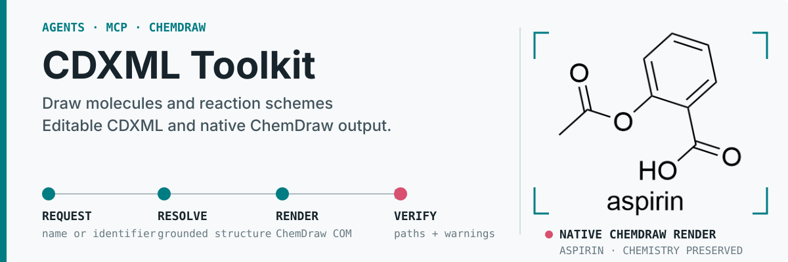
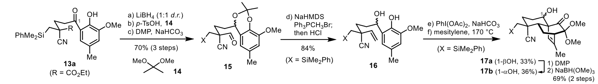
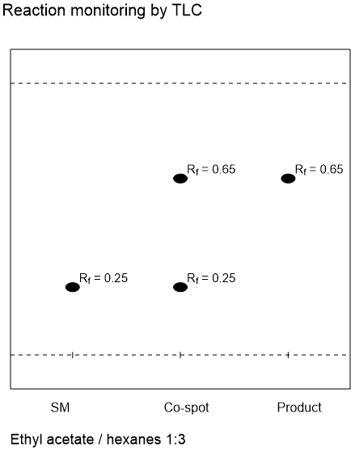
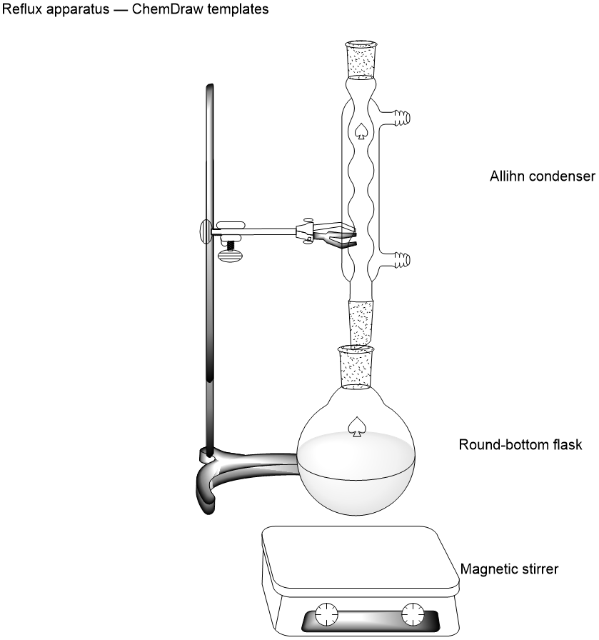
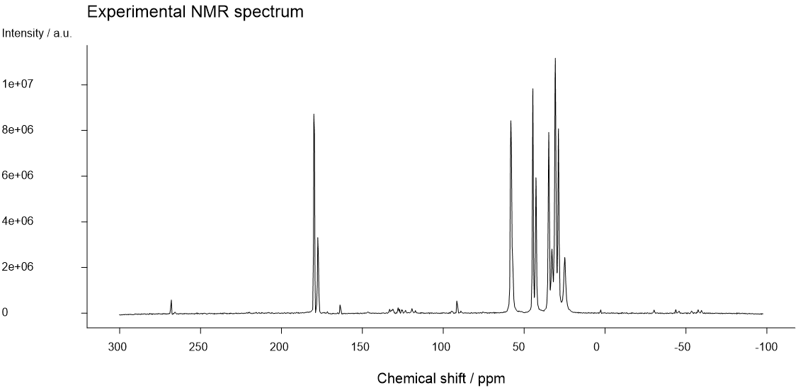
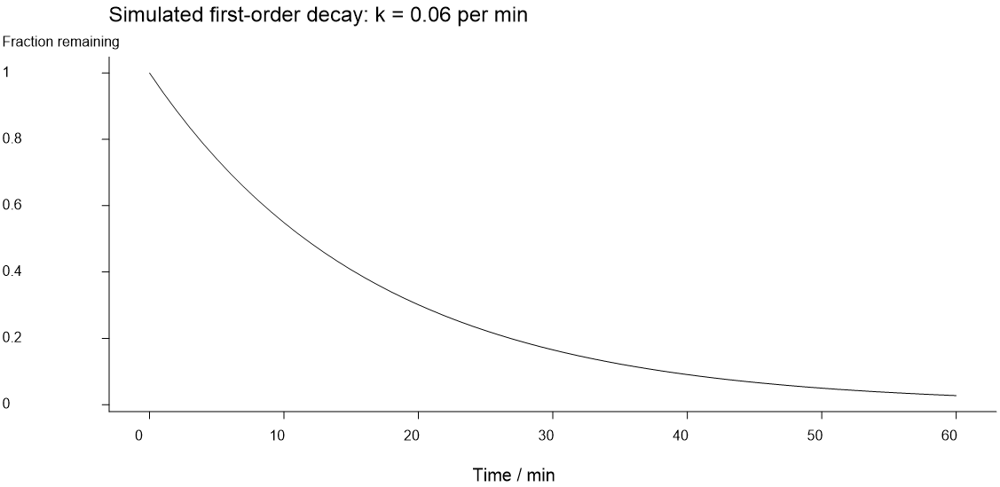
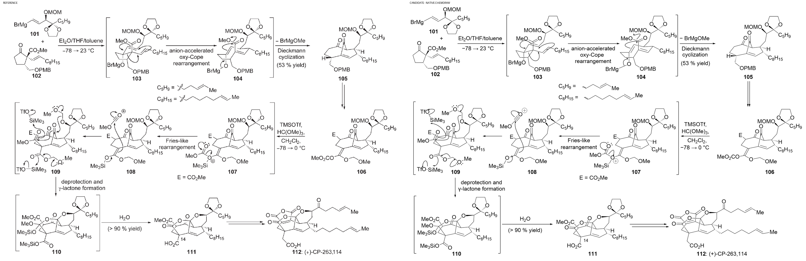
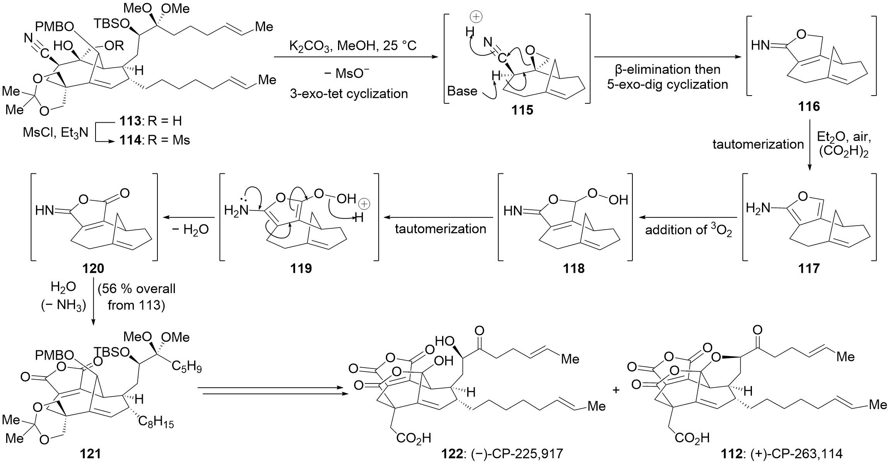
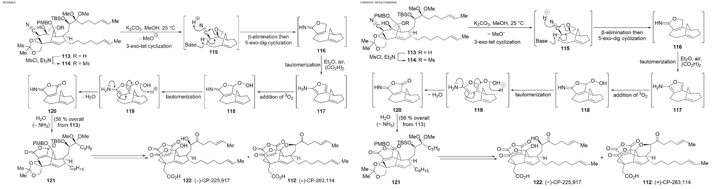
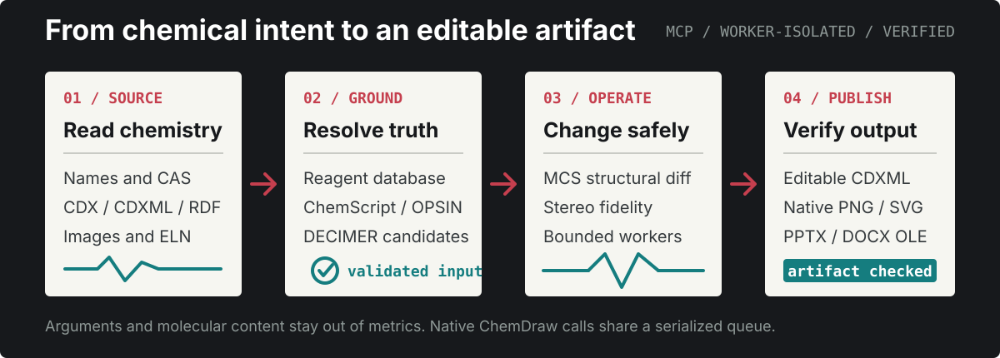

[English](README.md) · [简体中文](README.zh-cn.md)



> **Platform support:** Portable CDXML and RDKit workflows run on Windows, macOS,
> and Linux. ChemDraw COM rendering, ChemScript, and editable ChemDraw objects in
> Word or PowerPoint require a Windows host with a licensed desktop ChemDraw
> installation.

<p align="center">
  <a href="https://github.com/ZiChenWang114514/cdxml-toolkit-community/actions/workflows/validate.yml"></a>
  <a href="https://github.com/ZiChenWang114514/cdxml-toolkit-community/releases/tag/v0.7.0a1"></a>
  <a href="https://www.python.org/"></a>
  <a href="./docs/mcp-tools.md"></a>
  <a href="./LICENSE"></a>
</p>

<p align="center">
  <strong>A community-maintained MCP and Python runtime for reliable chemistry artifact work.</strong><br>
  Resolve structures, compare molecules, build reaction schemes, inspect experiments, and deliver editable CDXML or ChemDraw objects in Office.
</p>

<p align="center">
  <a href="#featured-demos">Featured demos</a> ·
  <a href="#quick-start">Quick start</a> ·
  <a href="#connect-an-agent">Connect an agent</a> ·
  <a href="#tool-profiles">Tool profiles</a> ·
  <a href="./docs/mcp-tools.md">Tool reference</a> ·
  <a href="./docs/maintenance.md">Maintenance</a>
</p>

## Featured demos

Explore real paper images and data through native previews, reference comparisons and editable downloads.

| Case | What it demonstrates | Available scope |
| --- | --- | --- |
| [Paper reaction scheme](#paper-scheme-demo) | Five structures, conditions, yields and wavy bonds | Complete figure; not pixel-identical |
| [Sceptrin mechanism](#mechanism-demo) | Eight structures, electron arrows, charges and conditions | Complete figure; not pixel-identical |
| [Native TLC](#tlc-demo) | Editable lanes, spots and Rf | Runnable example |
| [Native apparatus](#apparatus-demo) | Assembly from native ChemDraw templates | Runnable example |
| [Experimental NMR](#nmr-demo) | Real processed 1D data and an editable spectrum | Runnable example |
| [Simulated reaction kinetics](#kinetics-demo) | Numerical data as editable curves | Runnable example |
| [Complex synthesis: 101–112](#synthesis-101-demo) | Full native scheme and electron arrows | Stereo acceptance pending; not 1:1 |
| [Complex synthesis: 113–122](#synthesis-113-demo) | Full native scheme and electron arrows | Stereo acceptance pending; not 1:1 |

<a id="paper-scheme-demo"></a>

### Paper reaction scheme

**Turn a published reaction scheme into an editable ChemDraw document.** This example preserves the five structures, reaction conditions, yields and compound labels shown in the reference image.

**Original paper figure**



**Editable reconstruction — ChemDraw-native output**


[Download editable CDXML](assets/readme/paper-replica/replica.cdxml) · [Inspect structure-by-structure comparisons](assets/readme/paper-replica/structure-comparison.png) · [Source and verification details](assets/readme/paper-replica/provenance.json)

Structures extracted from the saved CDXML match the five reviewed reference structures. The shared wavy bond for 17a/17b remains unspecified, as in the original figure.

**Visually reviewed and editable; not pixel-identical.** Font metrics, arrows and some line geometry still differ. Matching saved structures does not independently prove that every detail was recognized correctly.

<a id="mechanism-demo"></a>

### Sceptrin mechanism

**Reference excerpt**


**ChemDraw reconstruction**


[Editable CDXML](assets/readme/mechanism/mechanism.cdxml) · [Native CDX](assets/readme/mechanism/mechanism.cdx) · [Side-by-side comparison](assets/readme/mechanism/comparison.png) · [Verification and source limitations](assets/readme/mechanism/provenance.json)

Eight numbered structures and six chloride counterions retain their molecular inventory, depicted stereochemistry and formal charges through an actual ChemDraw CDXML → CDX → CDXML save cycle. Undefined R groups remain generic substituents. The reconstruction is visually reviewed, **not pixel-identical**: font metrics, electron-arrow paths, some bridge geometry and the placement of the delocalized charge indicators differ. The source's cropped recrystallization statement is not completed by inference.

<a id="tlc-demo"></a>

### Native TLC

Native TLC plate, lane and spot objects with illustrative Rf values.



[Editable CDXML](assets/readme/scientific/tlc.cdxml) · [Run this example](docs/scientific-workflows.md) · [Data and template provenance](assets/readme/scientific/provenance.json)

<a id="apparatus-demo"></a>

### Native apparatus

Built from installed ChemDraw apparatus templates, preserving their editable native artwork.



[Editable CDXML](assets/readme/scientific/apparatus.cdxml) · [Run this example](docs/scientific-workflows.md) · [Data and template provenance](assets/readme/scientific/provenance.json)

<a id="nmr-demo"></a>

### Experimental NMR

Real processed 1D NMR data, with peak picking and selected-region integration available. No automatic atom assignment.



[Editable CDXML](assets/readme/scientific/nmr.cdxml) · [Run this example](docs/scientific-workflows.md) · [Data and template provenance](assets/readme/scientific/provenance.json)

<a id="kinetics-demo"></a>

### Simulated reaction kinetics

Explicitly simulated first-order decay demonstrates the numerical-data-to-figure workflow.



[Editable CDXML](assets/readme/scientific/kinetics.cdxml) · [Run this example](docs/scientific-workflows.md) · [Data and template provenance](assets/readme/scientific/provenance.json)

<a id="synthesis-101-demo"></a>

### Complex synthesis: 101–112

**Full scheme with editable structures.** Includes every compound number, reaction condition and mechanism arrow. Native saving preserves connectivity, charge, isotopes and alkene geometry. Bridgehead stereochemistry remains unresolved, and font and line geometry differ; this is not a validated 1:1 reproduction.


[Full editable CDXML](assets/readme/synthesis-101-112/figure.cdxml) · [Reference comparison](assets/readme/synthesis-101-112/comparison-full.png) · [Acceptance and provenance](assets/readme/synthesis-101-112/provenance.json)

<details>
<summary>Compare the complete reference and reconstruction</summary>



</details>

<a id="synthesis-113-demo"></a>

### Complex synthesis: 113–122

**Full scheme with editable structures.** Includes every compound number, reaction condition and mechanism arrow. Native saving preserves connectivity, charge, isotopes and alkene geometry. Bridgehead stereochemistry remains unresolved, and font and line geometry differ; this is not a validated 1:1 reproduction.



[Full editable CDXML](assets/readme/synthesis-113-122/figure.cdxml) · [Reference comparison](assets/readme/synthesis-113-122/comparison-full.png) · [Acceptance and provenance](assets/readme/synthesis-113-122/provenance.json)

<details>
<summary>Compare the complete reference and reconstruction</summary>



</details>

## Reconstruction scope and structure review

Both complex synthesis examples contain the complete layout, native molecular structures, text, brackets and electron arrows. Molecules remain editable atoms, bonds and expandable abbreviations; screenshots and traced outlines do not substitute for molecular objects.

| Check | Current result |
| --- | --- |
| Connectivity, elements, charge, isotopes and alkene geometry after native saving | Save-cycle checks pass for both figures |
| Complete stereochemistry | Not accepted; RDKit and ChemScript return opposing assignments at some bridgeheads |
| Visual comparison with the reference | Native previews and full comparisons inspected; font, arrow and some line geometry still differ |
| Strict pixel-for-pixel 1:1 | Not achieved |

Save-cycle agreement does not establish perfect recognition of the reference. Compounds 105–109, 115–120 and 121 contain conflicting specified configurations; some expanded chains and abbreviation definitions in the source also need clarification. The reconstructions preserve each depiction rather than silently making the route chemically self-consistent. The [atom-level comparison](examples/paper-reconstructions/stereochemistry-check.json) records component hashes and atom mappings for review; absence of a disagreement does not independently establish source stereochemistry.

After installing the runtime, rebuild these two layouts offline without repeating DECIMER recognition:

```powershell
python examples/paper-reconstructions/rebuild.py ./paper-figures-output
```

Use a new output directory. This assembles saved molecular components; native previews still require Windows ChemDraw. See the [rebuild example and limitations](examples/paper-reconstructions/README.md). Source paper artwork is not relicensed under the software license.

## Publication figures

Create editable figures with explicit atom coordinates, six reaction-arrow styles, electron arrows, rich conditions, atom numbering and native-template preservation.

| Tool | Use it for |
| --- | --- |
| `compose_chemical_figure` | Fixed-coordinate structures, arrows, rich text, grids, highlights and native templates |
| `rdkit_workbench` | Inspect atom indices and CIP labels; explicit stereo edits, bounded stereoisomer/tautomer enumeration, MCS and R-group decomposition |
| `compare_figure_images` | Save side-by-side images and difference measurements for actual visual review |

The renderer checks chemical identity by extracting structures from the saved CDXML. Wavy bonds remain unspecified; enhanced AND/OR/ABS stereo groups are retained. Chemistry checks and visual similarity are separate: neither a valid SMILES nor a low image-difference score proves a faithful paper reproduction. Unsupported fresh radical and non-tetrahedral depictions require a verified native template.

**Installation:** these features require the source version installed by the Quick Start commands; they are not included in the `v0.7.0a1` release.

## What it provides

| Area | Practical result |
| --- | --- |
| Chemistry grounding | Resolve names, abbreviations, CAS numbers, formulas, and recognized image candidates through databases, ChemScript, OPSIN, or DECIMER. |
| Controlled structure work | Compare molecules, apply named transformations, preserve stereochemistry, and inspect MCS-based structural differences. |
| ChemDraw output | Draw molecules, clean or merge schemes, convert CDX/CDXML, and render native PNG or SVG files. |
| Laboratory figures | Native TLC objects and Rf measurement; editable apparatus assembled from installed ChemDraw templates. |
| Scientific data | Peak picking and selected-region integration for processed 1D NMR; editable numerical plots. No automatic atom assignment or complete FID pipeline. |
| Office workflows | Extract, replace, and batch-embed editable ChemDraw OLE objects in PowerPoint and Word. |
| Experiment workflows | Parse ELN exports, SciFinder RDF, LCMS or NMR reports, and assemble structured lab-book material. |
| Agent service | Run through stdio locally or authenticated Streamable HTTP for a trusted remote computer. |

## Quick start

**Required:** 64-bit Python 3.10–3.13. Portable CDXML and RDKit operations run without ChemDraw. Native rendering, ChemScript, and editable Office objects require Windows plus a licensed desktop ChemDraw installation. Python 3.14 is not supported yet.

```powershell
conda create -n cdxml python=3.12 pip -y
conda activate cdxml

git clone https://github.com/ZiChenWang114514/cdxml-toolkit-community.git
Set-Location .\cdxml-toolkit-community

# Both distributions expose the cdxml_toolkit import package.
pip uninstall -y cdxml-toolkit
pip install -e ".[all]"

# Read-only environment and capability report.
cdxml-doctor --no-tests
```

The default installation includes the portable CDXML, RDKit, and MCP runtime. Optional groups are `windows`, `office`, `chemscript`, `analysis`, `scientific`, `image`, `decimer`, `opsin`, `http`, `all`, and `dev`.

Install the current community source directly when a checkout is unnecessary:

```powershell
pip install "cdxml-toolkit-community[all] @ git+https://github.com/ZiChenWang114514/cdxml-toolkit-community.git@main"
```

<details>
<summary><strong>ChemScript and Java setup</strong></summary>

`cdxml-doctor --no-tests` does not change the machine. To detect ChemDraw and prepare a compatible ChemScript environment interactively, run:

```powershell
cdxml-doctor --no-tests --configure-chemscript
cdxml-doctor --json
```

ChemScript is optional. OPSIN provides offline IUPAC name resolution when Java is available. The wheel does not bundle a JRE; the runtime first checks `JAVA_HOME` and `java` on `PATH`. A pre-approved local archive can be installed with explicit integrity metadata:

```powershell
$env:CDXML_TOOLKIT_JRE_ZIP = "C:\installers\temurin-jre.zip"
$env:CDXML_TOOLKIT_JRE_SHA256 = "approved sha256"
cdxml-doctor --no-tests
```

Archive size, extracted size, paths, links, and optional SHA-256 are checked before installation.
</details>

## Connect an agent

Any MCP-compatible agent can connect to the runtime. Start the full 38-tool stdio service:

```powershell
cdxml-mcp
```

Register the Python interpreter and arguments in your client's MCP configuration. A common JSON format is:

```json
{
  "mcpServers": {
    "chemdraw": {
      "command": "C:\\Users\\YOU\\miniconda3\\envs\\cdxml\\python.exe",
      "args": ["-m", "cdxml_toolkit.mcp_runtime"]
    }
  }
}
```

Configuration location and syntax depend on the client. Restart the agent, then try:

```text
Resolve aspirin, draw it as CDXML, and render a PNG preview.
```

For paper reconstruction and laboratory figures, load the client-independent [ChemDraw Skill](https://github.com/ZiChenWang114514/chemdraw-skill). The historical profile identifier `codex` remains available for compatibility; it does not restrict which agent can use the tools.

Copy [`CLAUDE.md`](./CLAUDE.md) into an agent workspace when the client supports project instructions. It tells the agent to obtain molecular structures from tools, use OCSR for images, preserve chemical semantics, and verify transformations instead of inventing structure strings.

## How the runtime works

<p align="center">
  
</p>

Important runtime properties:

- Tool calls run in subprocess workers with configurable hard timeouts and structured errors.
- ChemDraw, Word, and PowerPoint automation share serialized native-resource coordination.
- Output-producing tools validate artifacts and avoid unintentionally replacing existing files.
- Metrics record counts, duration, timeouts, worker failures, and queue length without tool arguments or molecular content.
- `get_toolkit_capabilities` reports the available local features before an agent chooses a workflow.

## Tool profiles

Choose the smallest useful profile to reduce tool-selection noise:

| Profile | Tools | Focus |
| --- | ---: | --- |
| `core` | 16 | Compatible core tools plus capability discovery |
| `office` | 21 | Office inspection, replacement, templates, and batch embedding |
| `analysis` | 20 | Experiment discovery, LCMS series, lab books, and SciFinder RDF |
| `chemscript` | 20 | Molecule comparison and controlled ChemScript SDK access |
| `codex` | 38 | Complete local and remote collection |

The generated [MCP tool reference](./docs/mcp-tools.md) and [JSON schema](./docs/mcp-schema.json) contain the exact live signatures. CI checks both files for drift.

## Streamable HTTP

Stdio remains the local default. An activated Windows workstation can serve a trusted remote computer after installing the `http` extra:

```powershell
$env:CHEMDRAW_MCP_HTTP_API_KEY = "generate-a-long-random-value"
cdxml-mcp --transport streamable-http --host 0.0.0.0 --port 8029 `
  --allowed-host chemdraw-host.example:8029 `
  --allowed-origin https://trusted-client.example
```

Remote binding requires a bearer key and an explicit host list. `/health` contains no molecule data; `/metrics` requires authentication when the server is remotely reachable.

DECIMER image upload is disabled by default. Remote recognition requires `confirm_upload=true`, validates that the payload decodes as an image, and enforces request and response limits.

## Command line

| Command | Purpose |
| --- | --- |
| `cdxml-mcp` | Complete MCP runtime; 38-tool `codex` profile by default |
| `cdxml-mcp-core` | Compatible 15-tool core server |
| `cdxml-doctor` | Read-only diagnostics, tests, and explicit ChemScript setup |
| `cdxml-render` | Render JSON, YAML, or compact text to CDXML |
| `cdxml-image` | Render CDXML to PNG or SVG |
| `cdxml-merge` / `cdxml-layout` | Merge schemes or clean reaction layout |
| `cdxml-ole` | Embed editable ChemDraw objects in PPTX or DOCX |
| `cdxml-lcms` / `cdxml-nmr` | Parse instrument reports |
| `cdxml-mcp-docs` | Regenerate the Markdown and JSON tool references |

The scheme renderer accepts YAML, reaction JSON, and a compact text syntax described in the [showcase catalog](./experiments/scheme_dsl/showcase/INDEX.md).

## Development

```powershell
python -m pip install -e ".[dev,windows,office,analysis,image,scientific]"
python -m pytest -m "not network" -q
python -m build
python -m twine check dist/*
```

Hosted CI checks Python 3.10–3.13, MCP SDK 1.x and 2.x, generated references, portable tests, and distributions. Native ChemDraw, ChemScript, Word, and PowerPoint checks run on a licensed Windows workstation.

Read the [contribution guide](./.github/contributing.md), [security policy](./.github/SECURITY.md), and [maintenance guide](./docs/maintenance.md) before proposing or releasing changes.

## Community stewardship

This repository continues [`leehiufung911/cdxml-toolkit`](https://github.com/leehiufung911/cdxml-toolkit). The distribution is `cdxml-toolkit-community`; the compatible Python import remains `cdxml_toolkit`.

- Community maintainer: [ZiChenWang114514](https://github.com/ZiChenWang114514)
- Original author: Hiu Fung Kevin Lee ([@leehiufung911](https://github.com/leehiufung911))
- Third-party data and component notices: [NOTICE.md](./NOTICE.md)
- License: [MIT](./LICENSE)

The original project was directed by Hiu Fung Kevin Lee, a PhD organic chemist, and documented as built and tested with Claude Code (Opus 4.6).
