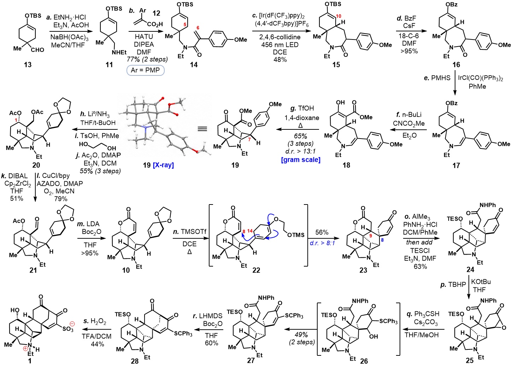

# Twenty-structure reconstruction: appearance and stereo interoperability

[Editable CDXML](reconstruction.cdxml) | [Native ChemDraw preview](native.png) | [Per-compound verification and hashes](verification.json)

[Source-oriented CDXML](source-oriented.cdxml) | [Source-oriented native preview](source-oriented.png) | [Incremental workflow evidence](incremental-verification.json)

This case reconstructs a user-provided synthesis figure from Ning and Maimone, [JACS, DOI 10.1021/jacs.5c17047](https://doi.org/10.1021/jacs.5c17047). It contains 20 editable molecular structures, editable conditions/arrows/labels, and one embedded X-ray crop. The X-ray panel was cropped from the supplied image, not redrawn or interpreted as a new structural model.

## What the measurements actually show

| Candidate | Same-scale ink IoU | Direct reader agreement |
| --- | ---: | ---: |
| Initial reconstruction | 0.4188 | 8/20 |
| Source-oriented revision | 0.6961 | 4/20 |
| Interoperability revision (download above) | 0.6960 | 20/20 |

The visual revision restored perspective bond styles, improving image similarity while revealing additional reader disagreement. The interoperability revision retained the reviewed ChemScript target for all 20 structures and passed a native save cycle. Across 98 specified centers before that repair, 24 were missing, 26 had opposite mapped assignments, and 48 agreed. After repair all 20 saved fragments matched the pre-repair ChemScript isomeric structures in both readers; stereo was not discarded. This is not an independent experimental determination of configuration.

Compound **1** required a consistent explicit wedge/hashed-wedge depiction, changing its appearance. The other 19 structures retained their preceding bond styles; native serialization may round subpixel coordinates. **This is not pixel-identical reproduction.** Metrics use translation/padding at unchanged scale, not independent image resizing. The final native image is 1452 x 1038 pixels, aligned by (30, 10) within the supplied 1488 x 1057 image. Pixel metrics cannot establish chemical correctness.

Verified environment: ChemDraw 22.2.0.3300, ChemScript 22.0.0.0, RDKit 2026.03.3 with the ChemDraw-backed parser. This evidence is specific to that environment. No claim is made that every reader version will agree.

## Failures, causes, and reusable corrections

| Failure | Cause observed here | Correction and acceptance boundary |
| --- | --- | --- |
| Parseable recognition output had incorrect groups/cages | OCSR confusions included atom labels, protecting groups and bridged topology | Retain raw candidates, inspect source crops and correct grounded structures before styling. Valid SMILES is not identity. |
| A bridge looked dashed or gained an intersection atom | Occlusion was treated as chemistry | Keep the original bond and native crossing depth; inspect each intersection. |
| Improved depiction worsened stereo agreement | Uniform Bold/Hash and explicit wedges carry different semantics | Track visual fidelity and saved-reader agreement separately. Preserve the source-oriented variant. |
| Labels reversed after moving them | Node label direction was not explicitly controlled | Use LabelDisplay and native readback, not only text justification. |
| NHEt, acid and NHPh labels looked correct but lost H | Suppressing label interpretation removed inferred hydrogen on native save | Restore only source-supported inner N/O hydrogen counts; compare formula, charge, H and radicals. Six structures needed this correction. |
| One shared-template structure remained badly distorted | Connectivity was shared but local geometry was not | Retrace the affected structure; local comparisons located the outlier hidden by whole-image metrics. |
| CIP-only edits passed initially but failed after saving | Native save rewrote stereo metadata; the active parser was order-sensitive near abbreviations | Diagnose the actual parser, map full graphs, test metadata/order changes locally and repeat native save. Cached AS is not ground truth. |
| Explicit N-H correction altered a neighboring cage center | Mixed perspective and explicit stereobonds coupled reader inference | Use a complete explicit depiction for compound 1, verify all centers, and disclose the visual change. |
| A generated report was mistaken for acceptance | Top-level success described report creation, not every gate | Inspect saved-file, semantic and cross-reader statuses independently and render the exact accepted bytes. |

XML node ordering and explicit CIP metadata were a compatibility workaround in this case, not a general stereochemical repair algorithm. Full-graph mappings must resolve symmetry before assigning centers; raw atom indices, ambiguous MCS mappings and hardcoded coordinate scales are insufficient. Upstream parser source must match the active parser family, and implementation hypotheses should not be promoted into universal rules.

## A shorter reliable workflow

1. Freeze source and target interpretation; inventory structures and nonchemical panels.
2. Test native saving on representative bridge/abbreviation/charged fragments early.
3. Resolve topology and stereo, then refine layout; reuse recognition and unchanged crops.
4. Diagnose affected fragments with compact mapped summaries, rather than repeating full SDK catalog reads and complete validation after each label move.
5. Run a complete native save and direct two-reader check on the final candidate; inspect its native image and changed details.
6. Publish separate chemistry, interoperability and visual conclusions, with hashes and unresolved limits.

The follow-up stereo repair took 25 min 44 sec to its report. Its recorded token interval was 7,356,570 tokens, including 7,230,848 cached input, 93,288 uncached input and 32,434 output. This is **not an efficiency benchmark**: repeated large context and diagnostic exploration were substantial overhead. Counts are differences of cumulative snapshots, exclude calls after the recorded cutoff, and are not a billing-cost estimate. Reasoning tokens are included in output, not added again. The follow-up reused recognition results and made no new DECIMER call.

The toolkit now exposes per-molecule hydrogen and radical-electron counts and an independent formula/charge composition comparison in figure-validation reports. These diagnostics make hidden losses easier to inspect; they do not automatically choose a stereoisomer or replace semantic comparison. Regression tests cover amine/acid H loss, radicals, isotope hydrogen accounting and charged nitrogen.

## Executable incremental workflow

The CLI `python -m cdxml_toolkit.mcp_runtime.reconstruction --arguments operation.json` now implements linked native-object/chemical records, content-verified candidate caching, conservative local check scheduling, a two-failure retry bound, same-scale overlays, frozen targets and dual delivery. It preserves native trees rather than repeatedly converting through SMILES layouts. No new MCP tool or automatic stereochemistry guesser is added.

The companion [Skill workflow](https://github.com/ZiChenWang114514/chemdraw-skill/blob/main/skill/chemdraw/references/incremental-reconstruction.md) documents every operation and its inputs. [Replay the reviewed fixture](../../../examples/paper-reconstructions/replay_incremental.py) with an authorized original screenshot; its hash must match the fixture. Native operations remain under the existing shared lock. The finalization gate requires explicit source/visual review tied to the exact native previews and validation hashes.

The first source-oriented import failed semantic preservation: native normalization added RDKit-readable stereo metadata, changing specified-center count from 0 to 74. It was not accepted as a harmless layout change. The separately retained, normalized source document then passed another native save and matched the reviewed ChemScript target. Its 16 RDKit disagreements remain disclosed; the compatibility document matches the target in both readers for all 20 structures. Both variants were inspected visually. This illustrates why the first import is an early probe, not the final acceptance.

In one controlled replay of three caption-size changes on the same 20-structure fixture, full native checks after every edit took **33.53 s / 8 native calls**, while change-based checks took **8.88 s / 2 native calls**. Both finished with the same final native-save and known-target inventory check. The measured ratio was **3.77x for this replay only**. Zero recognition calls occurred in either path; no agent-token savings were measured. This is a single run, not an end-to-end recognition benchmark or an accuracy estimate. The [benchmark script](../../../examples/paper-reconstructions/benchmark_incremental.py) and [recorded scope/results](incremental-verification.json) make the comparison inspectable.

The controller never caches final acceptance. Source/crop bytes, definitions, transform, parameters and tool versions are cache dependencies. Atom positions, bond styles and label semantics trigger chemical readback; simple font edits can remain local visual work. Unknown or shared-definition changes conservatively broaden the check. Symmetric/partial atom mappings stay unresolved instead of transferring an arbitrary configuration or pose.

## Source and rights

The linked files are reconstructed, third-party-derived scientific artwork. The embedded X-ray crop originates in the supplied published figure. **The repository MIT license does not license the paper artwork or embedded X-ray image.** Consult the publisher/rightsholder for permission and reuse terms. The original screenshot, machine paths, session logs and proprietary software are not redistributed. Verification.json contains selected local evidence and exact downloadable-file hashes; it is a record of the checks, not independent certification.
